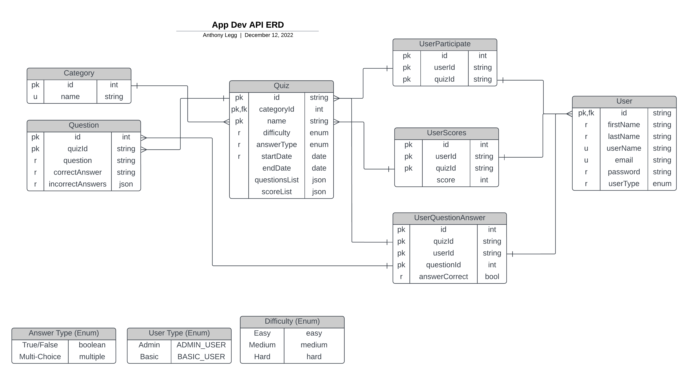

# Assessment 1 - @leggant

## :rocket: Deployment - Heroku

- [:anchor:__Heroku Deployment Pipeline__](https://dashboard.heroku.com/pipelines/7e5bc38d-d7f8-4030-9ad7-56505ed294d6)
- [:anchor:__Staging Deployment__](https://in-dev-app.herokuapp.com)
- [:anchor:__Production Deployment__](https://api-prod-app.herokuapp.com)

## API Documentation

- [:anchor:__API Documentation__](https://in-dev-app.herokuapp.com/docs/api/v1)
- [:anchor:__API Documentation__](https://api-prod-app.herokuapp.com/docs/api/v1)

### API End-Points

- [:anchor:__API Documentation__](https://in-dev-app.herokuapp.com/docs/api/v1/tutorial-api.html)
- [:anchor:__API Documentation__](https://api-prod-app.herokuapp.com/docs/api/v1/tutorial-api.html)

### API Local Set-Up

- [:anchor:__API Documentation__](https://in-dev-app.herokuapp.com/docs/api/v1/tutorial-setup.html)
- [:anchor:__API Documentation__](https://api-prod-app.herokuapp.com/docs/api/v1/tutorial-setup.html)

## Entity Relationship Diagram

[:anchor: Made with Lucidchart](https://lucid.app/lucidchart/d03c09c4-e9c0-4f14-bf42-dceaf7a4e0d8/edit?viewport_loc=-354%2C156%2C3162%2C1102%2C0_0&invitationId=inv_c9acfca4-7f84-4762-87a2-5b0f96bca0ea)




## API/Command Line Instructions

### Database Seeders

_user and category seeders are both available from admin-only endpoints_

1. user seeder endpoint: `/user/auth/admin/seeder/players`
2. category seeder endpoint: `/user/auth/admin/seeder/categories`

<https://opentdb.com/api_category.php>

### Migrate the Database

#### Seeder GISTS

#### Development

```node
npm run migrate:dev
```

##### Error Handling

If this command above outputs the following error:

```bash
Error: P3005

The database schema is not empty. Read more about how to baseline an existing production database: https://pris.ly/d/migrate-baseline
```

I found the only way to resolve this is to delete the locally stored migration file(s). e.g. `./prisma/migrations/**`
Then re-run the migration command:

```node
npm run migrate:dev
```

##### Additional Commands

```node
npm run reset:dev // reset the database
```

#### Production

```node
npm run resolve:dev 20221219234050_dev // folder name of the local migration ./prisma/migrations/20221219234050_dev
npm run migrate:prod // this command wil timeout, re-run until successfully completed
```

## Gist Links

__Note: more users added than required.__

- :anchor: [End-point for Basic Users](https://gist.githubusercontent.com/leggant/c88f9010d6664fa2f10a847c7102d933/raw/eb83f9678cb23e0042a6925df51c4c399a3a87e2/basic_user.json)
- :anchor: [End-point for Admin Users](https://gist.githubusercontent.com/leggant/c88f9010d6664fa2f10a847c7102d933/raw/eb83f9678cb23e0042a6925df51c4c399a3a87e2/admin_user.json)

## :bookmark_tabs: References  

- :anchor: <https://www.freecodecamp.org/news/the-express-handbook>
- :anchor: <https://express-validator.github.io/docs/index.html>
- :anchor: <https://youtu.be/YK-GurROGIg> [#12](https://github.com/otago-polytechnic-bit-courses/assessment-1-node-js-restful-api-leggant/issues/12)
- :anchor: <https://blog.devgenius.io/validating-user-inputs-on-your-express-js-application-with-express-validator-4d82b995f524>
- :anchor: <https://www.w3schools.com/jsref/jsref_startswith.asp>
- :anchor: <https://www.youtube.com/watch?v=7i7xmwowwCY>
- :anchor: <https://stackoverflow.com/questions/1050720/how-to-add-hours-to-a-date-object>
- :anchor: __database seeder__ <https://www.prisma.io/docs/guides/database/seed-database#example-seed-scripts>
- :anchor: <https://stackoverflow.com/questions/69526209/prisma-how-can-i-update-only-some-of-the-models-fields-in-update>
- :anchor: <https://bobbyhadz.com/blog/javascript-check-if-object-is-empty>
- :anchor: get first key/value from object <https://stackoverflow.com/a/56969714>
- :anchor: testing axios functions from the commandline using `run-func` npm package
  - <https://stackoverflow.com/a/43598047>
  - using the command: `npx run-func ./utils/axiosRequests.js getUsers` and
  - `npx env-cmd -f .env.development npx run-func ./api/v1/controllers/seeder_controller.js seedUsers`
- :anchor: get object count - <https://www.geeksforgeeks.org/find-the-length-of-a-javascript-object>
- :anchor: get specific values from array of objects
  - <https://www.designcise.com/web/tutorial/how-to-extract-specific-keys-values-from-an-array-of-objects-in-javascript>
- <https://stackoverflow.com/a/8016205>
- <https://developer.mozilla.org/en-US/docs/Web/JavaScript/Reference/Global_Objects/Date/now#try_it>
- filter objects by key: <https://masteringjs.io/tutorials/fundamentals/filter-key>
- <https://hackernoon.com/how-to-update-object-key-values-using-javascript>
- `npx run-func ./utils/axiosRequests.js getCategories`
- `npx run-func ./utils/dateTimeCheck.js getCategories`
- quiz date checks: <https://youtu.be/oOK3UzLJ_Cs> - testing: `npx run-func ./utils/dateTimeCheck.js quizDateValid 27 12 2022` and `npx run-func ./utils/dateTimeCheck.js quizEnddateValid 24 12 2022 30 12 2022`
- <https://stackoverflow.com/a/3367429> Get epoch for a specific date using Javascript
- <https://stackoverflow.com/a/61505926> MONTHS in JavaScript Dates starts in zero (0 = January, 11 = December)
- <https://developer.mozilla.org/en-US/docs/Web/JavaScript/Reference/Global_Objects/Date/getUTCDate#try_it>
- `npx run-func ./utils/dateTimeCheck.js playerCanParticipate 2022-12-30T20:26:46Z 2022-12-30T20:26:46Z`
- `npx run-func ./utils/dateTimeCheck.js playerCanParticipate 2022-12-30T20:26:46Z 2022-12-30T20:26:46Z`
- <https://stackoverflow.com/a/65724578>
- <https://www.delftstack.com/howto/javascript/javascript-decode-html-entities/#decode-html-entities-using-vanilla-javascript>
- `npx run-func ./utils/unescapeString.js default "What&#039;s Harry Potter&#039;s dad&#039;s name?"`
- `npx run-func ./utils/unescapeString.js default "Who was the author of the 1954 novel, \"Lord of the Flies\"?"`
- `npx run-func ./utils/calculatePlayerScore.js default`
- <https://stackoverflow.com/a/14854851> - jsdoc array of objects
- remove special chars from string <https://stackoverflow.com/a/16913929>
- `npx run-func ./utils/compareAnswerStrings.js default "Bobs Burgers, \"Lord of the Flies\"?" "Family Guy, \"Lord of the Flies\"?"`
- array flattening: <https://www.freecodecamp.org/news/flat-and-flatmap-javascript-array-methods>
- `npx run-func ./utils/unitTestDataRequests.js testDate`
- `npx run-func ./utils/unitTestDataRequests.js deleteTestAdminUser`