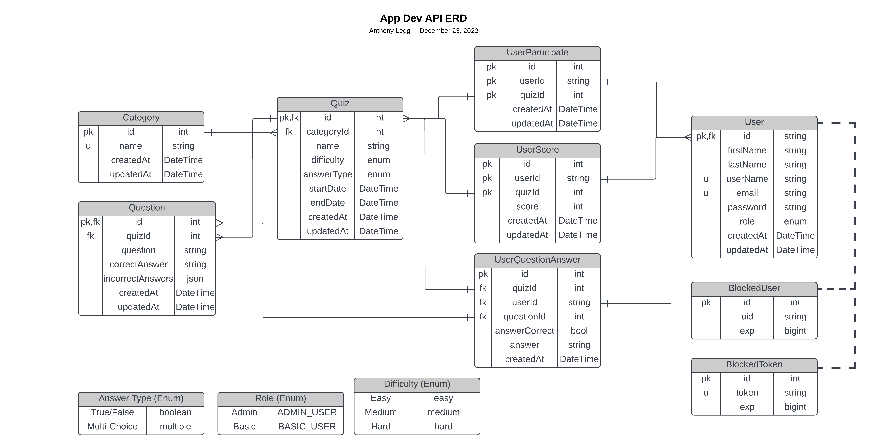

# Assessment 1 - @leggant

## :rocket: Deployment - Heroku

- [:anchor:__Heroku Deployment Pipeline__](https://dashboard.heroku.com/pipelines/7e5bc38d-d7f8-4030-9ad7-56505ed294d6)
- [:anchor:__Staging Deployment__](https://in-dev-app.herokuapp.com)
- [:anchor:__Production Deployment__](https://api-prod-app.herokuapp.com)

## API Documentation

- [:anchor:__API Documentation - Staging Server__](https://in-dev-app.herokuapp.com/docs/api/v1)
- [:anchor:__API Documentation - Production Server__](https://api-prod-app.herokuapp.com/docs/api/v1)

### API End-Points

- [:anchor:__API Documentation - Staging Server__](https://in-dev-app.herokuapp.com/docs/api/v1/tutorial-api.html)
- [:anchor:__API Documentation - Production Server__](https://api-prod-app.herokuapp.com/docs/api/v1/tutorial-api.html)

## Gist Links

- :anchor: [End-point for Basic Users](https://gist.githubusercontent.com/leggant/c88f9010d6664fa2f10a847c7102d933/raw/eb83f9678cb23e0042a6925df51c4c399a3a87e2/basic_user.json)
- :anchor: [End-point for Admin Users](https://gist.githubusercontent.com/leggant/c88f9010d6664fa2f10a847c7102d933/raw/eb83f9678cb23e0042a6925df51c4c399a3a87e2/admin_user.json)

## Entity Relationship Diagram

[:anchor: Made with Lucidchart](https://lucid.app/lucidchart/d03c09c4-e9c0-4f14-bf42-dceaf7a4e0d8/edit?viewport_loc=-354%2C156%2C3162%2C1102%2C0_0&invitationId=inv_c9acfca4-7f84-4762-87a2-5b0f96bca0ea)

## Database Seeders

*user and category seeders are both available from admin-only endpoints*

- [__Opentdb API Documentation__](https://opentdb.com/api_config.php)
- [__Opentdb API Categories__](https://opentdb.com/api_category.php)
  
1. user seeder endpoint: `/user/auth/admin/seeder/players`
2. category seeder endpoint: `/user/auth/admin/seeder/categories`

## :bookmark_tabs: References

- [:anchor: Express handbook (freecodecamp.org)](https://www.freecodecamp.org/news/the-express-handbook)
- [:anchor: Express validator](https://express-validator.github.io/docs/index.html)
- [:anchor: Express validator-user inputs](https://blog.devgenius.io/validating-user-inputs-on-your-express-js-application-with-express-validator-4d82b995f524)
- [:anchor: Stackoverflow - add hours to date](https://stackoverflow.com/questions/1050720/how-to-add-hours-to-a-date-object)
- [:anchor: JsDoc YouTube/Traversy Media](https://youtu.be/YK-GurROGIg)
- [:anchor: W3C School/Starts With](https://www.w3schools.com/jsref/jsref_startswith.asp)
- [:anchor: express-validator tutorial/YouTube](https://www.youtube.com/watch?v=7i7xmwowwCY)
- [:anchor: Database Seeder|Prisma Docs](https://www.prisma.io/docs/guides/database/seed-database#example-seed-scripts)
- [:anchor: Stackoverflow](https://stackoverflow.com/questions/69526209/prisma-how-can-i-update-only-some-of-the-models-fields-in-update)
- [:anchor: bobbyhadz.com/blog](https://bobbyhadz.com/blog/javascript-check-if-object-is-empty)
- [:anchor: Stackoverflow/get first key/value from object](https://stackoverflow.com/a/56969714)
- [:anchor: Stackoverflow/util function testing](https://stackoverflow.com/a/43598047)
- [:anchor: geeksforgeeks/object count](https://www.geeksforgeeks.org/find-the-length-of-a-javascript-object)
- [:anchor: get specific values from array of objects](https://www.designcise.com/web/tutorial/how-to-extract-specific-keys-values-from-an-array-of-objects-in-javascript)
- [:anchor: Stackoverflow](https://stackoverflow.com/a/8016205)
- [:anchor: MDN Date Docs](https://developer.mozilla.org/en-US/docs/Web/JavaScript/Reference/Global_Objects/Date/now#try_it)
- [:anchor: filter objects by key](https://masteringjs.io/tutorials/fundamentals/filter-key)
- [:anchor: how to update object key](https://hackernoon.com/how-to-update-object-key-values-using-javascript)
- [:anchor: quiz date validation](https://youtu.be/oOK3UzLJ_Cs)
- [:anchor: Get epoch for a specific date using Javascript](https://stackoverflow.com/a/3367429)
- [:anchor: MONTHS in JavaScript Dates starts in zero (0 = January, 11 = December)](https://stackoverflow.com/a/61505926)
- [:anchor: Stackoverflow](https://stackoverflow.com/a/65724578)
- [:anchor: javascript  decode html entities](https://www.delftstack.com/howto/javascript/javascript-decode-html-entities/#decode-html-entities-using-vanilla-javascript8)
- [:anchor: jsdoc array of objects](https://stackoverflow.com/a/14854851)
- [:anchor: remove special chars from string](https://stackoverflow.com/a/16913929)
- [:anchor: array flattening](https://www.freecodecamp.org/news/flat-and-flatmap-javascript-array-methods)

## Test Commands

- `npx run-func ./utils/compareAnswerStrings.js default "Bobs Burgers, \"Lord of the Flies\"?" "Family Guy, \"Lord of the Flies\"?"`
- `npx run-func ./utils/unescapeString.js default "Who was the author of the 1954 novel, \"Lord of the Flies\"?"`
- `npx run-func ./utils/unescapeString.js default "What&#039;s Harry Potter&#039;s dad&#039;s name?"`
- `npx run-func ./utils/dateTimeCheck.js playerCanParticipate 2022-12-30T20:26:46Z 2022-12-30T20:26:46Z`
- `npx run-func ./utils/dateTimeCheck.js quizDateValid 27 12 2022`
- `npx run-func ./utils/dateTimeCheck.js quizEnddateValid 24 12 2022 30 12 2022`
- `npx run-func ./utils/axiosRequests.js getCategories`
- `npx run-func ./utils/axiosRequests.js getUsers`
- `npx env-cmd -f .env.development npx run-func ./api/v1/controllers/seeder_controller.js seedUsers`

